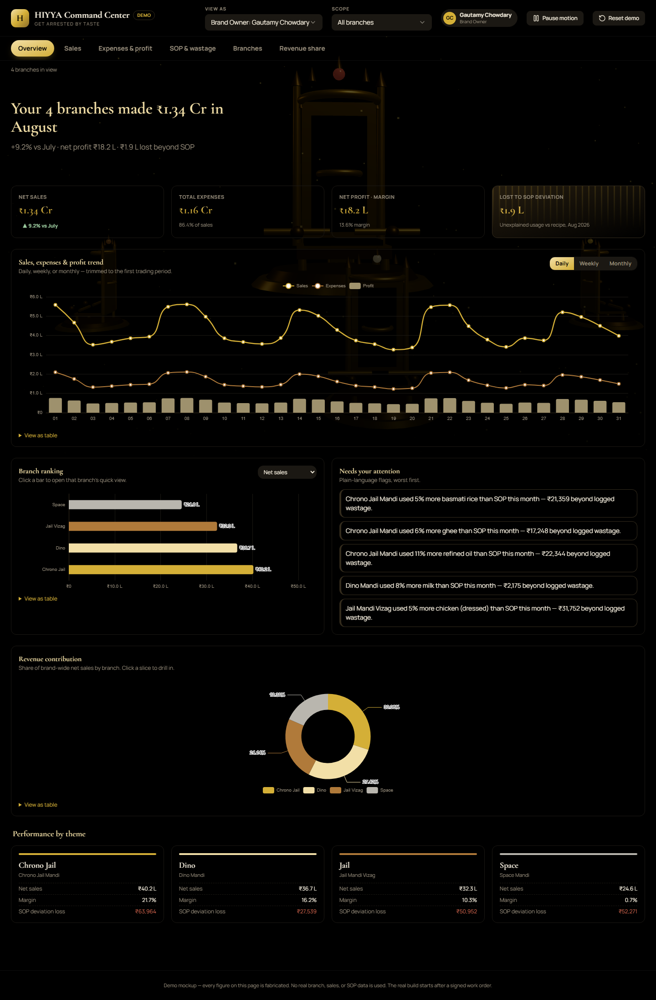
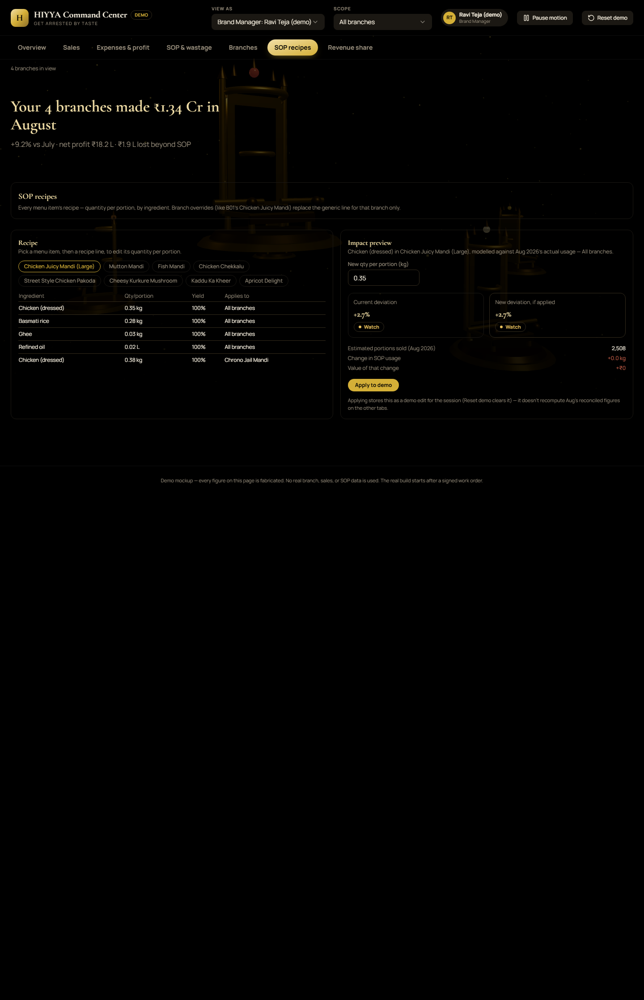
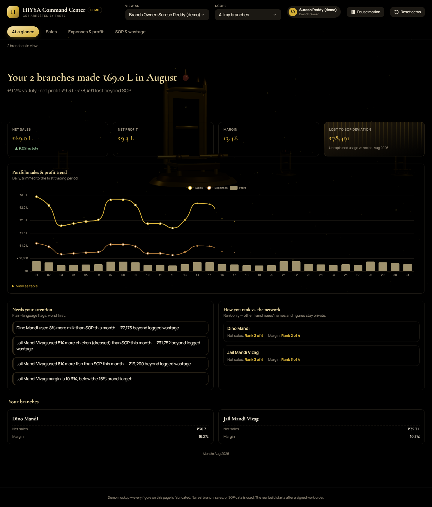
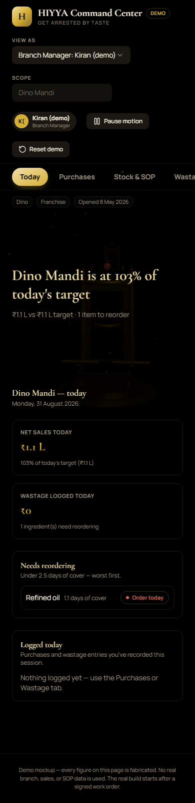

# HIYYA Command Center

A role-based analytics portal for HIYYA Kitchens (themed mandi restaurants, Hyderabad/AP). No login — a "View as" switcher in the header lets you step into any of four personas and see exactly the data, tabs, and edit rights that persona is scoped to. Every number on screen is computed by `lib/calc` from a single fabricated dataset, not hardcoded — see [`CLAUDE.md`](CLAUDE.md) for stack, conventions and process, and [`docs/PLAN.md`](docs/PLAN.md) for the phase-by-phase build log.

**Live demo:** <https://hiyya-kitchens-demo.vercel.app>

> This is a **Stage A demo**: fabricated August 2026 data, no authentication, no backend. Stage B (after a signed work order) swaps the mock data layer for Supabase behind the same interface — the UI doesn't need to change for that swap.

## Status

**Phases 0–7 complete** — every persona has its real screens; the app has been through an accessibility/performance polish pass. See [`docs/PLAN.md`](docs/PLAN.md) for what's in each phase and the exact commit for each.

## The four personas

| Persona              | Role                       | Sees                                                                                           | Screenshot                                                    |
| -------------------- | -------------------------- | ---------------------------------------------------------------------------------------------- | ------------------------------------------------------------- |
| Gautamy Chowdary     | Brand Owner                | Full brand P&L, all four branches, drill-downs, revenue share                                  |             |
| Gowtham Muvva (demo) | Brand Manager              | Same as Brand Owner, plus the SOP recipe editor with a live impact preview                     |  |
| Yugander (demo)      | Branch Owner (×2 branches) | Full analytics for owned branches, a portfolio roll-up, and an anonymised rank vs. the network |       |
| Satish (demo)        | Branch Manager             | Mobile-first: Today, Purchases, Stock & SOP, Wastage — no P&L                                  |               |

Branch Owners never see another branch's identifiable data (rank position only, never names or figures); Branch Managers never see profit or margin at all. Access control is enforced in `lib/access/scope.ts` and the data layer, not just hidden in the UI.

## What's in each tab

- **Overview / At a glance / Today** — KPIs, a sales & profit trend, plain-language "needs your attention" flags, and (Branch Owner) an anonymised network-rank card.
- **Sales** — daily sales by branch, weekday pattern, channel mix, top items with SOP food-cost % flagged over 45%.
- **Expenses & profit** — a sales-to-profit waterfall, monthly trend, daily break-even, and (Branch Owner) an **editable fixed-cost grid with live recalculation** — change Rent, watch net profit and margin update immediately.
- **SOP & wastage / Stock & SOP** — a deviation heatmap, biggest leaks by value, wastage by reason, and a full ingredient variance table; Branch Manager gets a read-only recipe reference plus reorder alerts.
- **SOP recipes** (Brand Manager only) — pick a menu item and a recipe line, propose a new quantity per portion, see the modelled deviation-% impact before applying it.
- **Branches** — a rank chart and league table with sparklines and health pills.
- **Revenue share** — royalty/marketing-fund split, per branch.
- **Purchases / Wastage** (Branch Manager) — log an entry, see it appear immediately in the list and on Today.

Every chart ships with a title, a one-line subtitle, and a real `<table>` a keyboard/screen-reader user can reach — never a chart alone. Click any rank-chart bar, donut slice, heatmap cell, or league-table row to open a focus-trapped drill-down dialog.

More screenshots at each phase's close-out: [`docs/screenshots/`](docs/screenshots/).

## Getting started

```bash
pnpm install
pnpm dev
```

Open <http://localhost:3000> — it redirects to `/overview` as the Brand Owner by default. Use the "View as" dropdown in the header to switch persona.

## Commands

| Command          | What it does                                                                                                                              |
| ---------------- | ----------------------------------------------------------------------------------------------------------------------------------------- |
| `pnpm dev`       | Local dev server                                                                                                                          |
| `pnpm build`     | Production build                                                                                                                          |
| `pnpm start`     | Serve the production build                                                                                                                |
| `pnpm lint`      | ESLint                                                                                                                                    |
| `pnpm typecheck` | `tsc --noEmit`                                                                                                                            |
| `pnpm format`    | Prettier, write mode                                                                                                                      |
| `pnpm test`      | Vitest — the calculation engine, unit-tested against the acceptance values in `docs/PLAN.md`                                              |
| `pnpm e2e`       | Playwright, `chromium` (1440px) + `mobile` (390px) — builds and serves a production bundle first, then runs 60 cases across every persona |

## Architecture

- **Next.js 14 (App Router), TypeScript strict.** One dynamic route (`app/[tab]/page.tsx`) renders a different component per persona role × tab id — each tab is its own `next/dynamic` chunk, so a session only ever downloads its own role's screens, not all six personas' worth.
- **`DataSource` is an interface** (`lib/data/DataSource.ts`). `MockDataSource` implements it today against a generated JSON dataset; a future `SupabaseDataSource` implements the same methods against Postgres — no component ever imports the mock data directly.
- **`lib/calc/*`** is a pure, fully unit-tested calculation engine — P&L, SOP deviation, reorder status, ranking, fixed-cost overrides. The UI never computes a number inline.
- **`lib/access/scope.ts`** is the one place access control lives: `resolveScopeToBranchCodes` (what a scope means) is deliberately separate from `accessibleBranchCodes` (what a persona is allowed to ask for), so a component can never accidentally widen its own access.
- **Zustand** holds UI state and in-memory demo edits (fixed-cost overrides, purchases, wastage entries, SOP overrides) — only the motion-preference toggle persists across a reload; everything else resets, by design (no fake data survives a refresh).
- **Apache ECharts** for every chart. Two themes — dark (black-and-gold) and pastel (cream-and-terracotta) — switched via the header's theme toggle; every chart reads its palette through `useThemeColors()` rather than a fixed import, so switching themes repaints charts too.

## Accessibility & performance

A dedicated Phase 7 pass: Lighthouse **Accessibility 100 / Best Practices 100 / SEO 91** on Overview (desktop). Fixed a genuine heading-order gap (KPI-card captions were marked as headings; several section headings skipped a level) and an unlabelled `<select>`. Every interactive control respects `prefers-reduced-motion`. Splitting each tab into its own chunk cut the shared route's First Load JS from ~597 kB to ~193 kB.

## Legacy artifact

`legacy-demo/` holds the original single-file HTML mockup built before this Next.js rebuild. It's kept for historical reference only and is not part of the live app.
